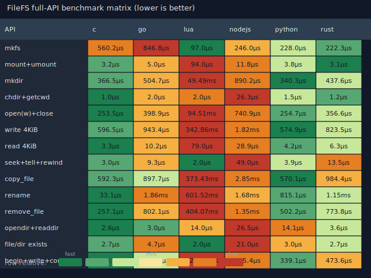

# FileFS

FileFS: Implement a virtual file system within a single file.

## Layout

```
.
├── bench/      # Cross-language full-API benchmark harness + matrix
├── c/          # C implementation (original)
├── cpp/        # Pure C++20 port
├── dotnet/     # Pure C# / .NET port
├── go/         # Pure-Go port
├── java/       # Pure Java 21 port
├── kotlin/     # Pure Kotlin/JVM port
├── lua/        # Pure Lua 5.4 port
├── moonbit/    # Pure MoonBit port
├── nodejs/     # Pure JavaScript ESM port
├── python/     # Python package (CPython bindings to c/)
├── rust/       # Pure-Rust port
├── swift/      # Pure Swift port
├── wasm/       # WebAssembly (Zig) + JS glue (in-memory image)
├── zig/        # Pure-Zig port
├── LICENSE
└── README.md
```

## C

```bash
cd c
make
./demo
```

See [c/README.md](c/README.md).

## C++

```bash
cmake -S cpp -B cpp/build -DCMAKE_BUILD_TYPE=Release
cmake --build cpp/build -j
ctest --test-dir cpp/build --output-on-failure
```

See [cpp/README.md](cpp/README.md).

## .NET

```bash
cd dotnet
dotnet test
```

See [dotnet/README.md](dotnet/README.md).

## Go

```bash
cd go
go build -o demo ./cmd/demo
./demo
```

See [go/README.md](go/README.md).

## Java

```bash
mvn -f java/pom.xml test
```

See [java/README.md](java/README.md).

## Kotlin

```bash
cd kotlin
./build.sh
```

See [kotlin/README.md](kotlin/README.md).

## Lua

```bash
cd lua
lua5.4 tests/run_tests.lua
```

See [lua/README.md](lua/README.md).

## MoonBit

```bash
cd moonbit
moon test
```

See [moonbit/README.md](moonbit/README.md).

## Node.js

```bash
cd nodejs
npm test
```

See [nodejs/README.md](nodejs/README.md).

## Python

```bash
cd python
python3 -m venv .venv
source .venv/bin/activate
pip install -e .
python -m unittest discover -s tests -v
```

See [python/README.md](python/README.md).

## Rust

```bash
cd rust
cargo test
```

See [rust/README.md](rust/README.md).

## Swift

```bash
cd swift
swift test
```

See [swift/README.md](swift/README.md).

## WebAssembly

```bash
cd wasm
zig build
npm test
```

In-memory FileFS image for browser/Node via Zig `wasm32-freestanding` + JS glue.  
See [wasm/README.md](wasm/README.md).

## Zig

```bash
cd zig
zig build test
```

See [zig/README.md](zig/README.md).

Host language ports share the same on-disk format (512-byte blocks, magic `78 11 45 14`).  
The Wasm port uses the same block layout in an in-memory image suitable for browsers.

## Performance matrix

<!-- BENCH_MATRIX_BEGIN -->

Cross-language full-API microbenchmarks (`ns/op`, lower is better).
Workload: `filefs-full-api` · iterations=20 · payload=4096 bytes.
Cell colors are **row-relative** (green = faster for that API among measured ports, red = slower).



<details><summary>Numeric matrix (HTML)</summary>

<table>
<thead><tr>
<th bgcolor="#2c3e50"><font color="#ecf0f1">API \ Lang</font></th>
<th bgcolor="#2c3e50"><font color="#ecf0f1">c</font></th>
<th bgcolor="#2c3e50"><font color="#ecf0f1">cpp</font></th>
<th bgcolor="#2c3e50"><font color="#ecf0f1">dotnet</font></th>
<th bgcolor="#2c3e50"><font color="#ecf0f1">go</font></th>
<th bgcolor="#2c3e50"><font color="#ecf0f1">java</font></th>
<th bgcolor="#2c3e50"><font color="#ecf0f1">kotlin</font></th>
<th bgcolor="#2c3e50"><font color="#ecf0f1">lua</font></th>
<th bgcolor="#2c3e50"><font color="#ecf0f1">moonbit</font></th>
<th bgcolor="#2c3e50"><font color="#ecf0f1">nodejs</font></th>
<th bgcolor="#2c3e50"><font color="#ecf0f1">python</font></th>
<th bgcolor="#2c3e50"><font color="#ecf0f1">rust</font></th>
<th bgcolor="#2c3e50"><font color="#ecf0f1">swift</font></th>
<th bgcolor="#2c3e50"><font color="#ecf0f1">wasm</font></th>
<th bgcolor="#2c3e50"><font color="#ecf0f1">zig</font></th>
</tr></thead><tbody>
<tr>
<th bgcolor="#34495e"><font color="#ecf0f1">mkfs</font></th>
<td bgcolor="#c7e89a" title="c / mkfs: 193552 ns/op" align="right"><code>193.6µs</code></td>
<td bgcolor="#c7e89a" title="cpp / mkfs: 191270 ns/op" align="right"><code>191.3µs</code></td>
<td bgcolor="#e67e22" title="dotnet / mkfs: 256000 ns/op" align="right"><code>256.0µs</code></td>
<td bgcolor="#57a773" title="go / mkfs: 191088 ns/op" align="right"><code>191.1µs</code></td>
<td bgcolor="#c0392b" title="java / mkfs: 550710 ns/op" align="right"><code>550.7µs</code></td>
<td bgcolor="#c0392b" title="kotlin / mkfs: 580128 ns/op" align="right"><code>580.1µs</code></td>
<td bgcolor="#57a773" title="lua / mkfs: 97500 ns/op" align="right"><code>97.5µs</code></td>
<td bgcolor="#1b7f4e" title="moonbit / mkfs: 61456 ns/op" align="right"><code>61.5µs</code></td>
<td bgcolor="#f5b041" title="nodejs / mkfs: 216200 ns/op" align="right"><code>216.2µs</code></td>
<td bgcolor="#e67e22" title="python / mkfs: 441962 ns/op" align="right"><code>442.0µs</code></td>
<td bgcolor="#f9e79f" title="rust / mkfs: 204218 ns/op" align="right"><code>204.2µs</code></td>
<td bgcolor="#f5b041" title="swift / mkfs: 214062 ns/op" align="right"><code>214.1µs</code></td>
<td bgcolor="#1b7f4e" title="wasm / mkfs: 1490 ns/op" align="right"><code>1.5µs</code></td>
<td bgcolor="#f9e79f" title="zig / mkfs: 194190 ns/op" align="right"><code>194.2µs</code></td>
</tr>
</tbody></table>
<tr>
<th bgcolor="#34495e"><font color="#ecf0f1">mount+umount</font></th>
<td bgcolor="#1b7f4e" title="c / mount_umount: 2994 ns/op" align="right"><code>3.0µs</code></td>
<td bgcolor="#57a773" title="cpp / mount_umount: 3206 ns/op" align="right"><code>3.2µs</code></td>
<td bgcolor="#f9e79f" title="dotnet / mount_umount: 7650 ns/op" align="right"><code>7.7µs</code></td>
<td bgcolor="#c7e89a" title="go / mount_umount: 5007 ns/op" align="right"><code>5.0µs</code></td>
<td bgcolor="#e67e22" title="java / mount_umount: 34398 ns/op" align="right"><code>34.4µs</code></td>
<td bgcolor="#c0392b" title="kotlin / mount_umount: 53360 ns/op" align="right"><code>53.4µs</code></td>
<td bgcolor="#c0392b" title="lua / mount_umount: 93000 ns/op" align="right"><code>93.0µs</code></td>
<td bgcolor="#e67e22" title="moonbit / mount_umount: 31478 ns/op" align="right"><code>31.5µs</code></td>
<td bgcolor="#f5b041" title="nodejs / mount_umount: 12062 ns/op" align="right"><code>12.1µs</code></td>
<td bgcolor="#f9e79f" title="python / mount_umount: 5717 ns/op" align="right"><code>5.7µs</code></td>
<td bgcolor="#57a773" title="rust / mount_umount: 3038 ns/op" align="right"><code>3.0µs</code></td>
<td bgcolor="#f5b041" title="swift / mount_umount: 15706 ns/op" align="right"><code>15.7µs</code></td>
<td bgcolor="#1b7f4e" title="wasm / mount_umount: 735 ns/op" align="right"><code>735ns</code></td>
<td bgcolor="#c7e89a" title="zig / mount_umount: 4374 ns/op" align="right"><code>4.4µs</code></td>
</tr>
</tbody></table>
<tr>
<th bgcolor="#34495e"><font color="#ecf0f1">mkdir</font></th>
<td bgcolor="#57a773" title="c / mkdir: 333892 ns/op" align="right"><code>333.9µs</code></td>
<td bgcolor="#e67e22" title="cpp / mkdir: 885328 ns/op" align="right"><code>885.3µs</code></td>
<td bgcolor="#f5b041" title="dotnet / mkdir: 657000 ns/op" align="right"><code>657.0µs</code></td>
<td bgcolor="#57a773" title="go / mkdir: 399884 ns/op" align="right"><code>399.9µs</code></td>
<td bgcolor="#f5b041" title="java / mkdir: 790634 ns/op" align="right"><code>790.6µs</code></td>
<td bgcolor="#f9e79f" title="kotlin / mkdir: 608362 ns/op" align="right"><code>608.4µs</code></td>
<td bgcolor="#c0392b" title="lua / mkdir: 50326000 ns/op" align="right"><code>50.33ms</code></td>
<td bgcolor="#c0392b" title="moonbit / mkdir: 1492700 ns/op" align="right"><code>1.49ms</code></td>
<td bgcolor="#f9e79f" title="nodejs / mkdir: 615707 ns/op" align="right"><code>615.7µs</code></td>
<td bgcolor="#e67e22" title="python / mkdir: 796998 ns/op" align="right"><code>797.0µs</code></td>
<td bgcolor="#c7e89a" title="rust / mkdir: 420977 ns/op" align="right"><code>421.0µs</code></td>
<td bgcolor="#1b7f4e" title="swift / mkdir: 302685 ns/op" align="right"><code>302.7µs</code></td>
<td bgcolor="#1b7f4e" title="wasm / mkdir: 3372 ns/op" align="right"><code>3.4µs</code></td>
<td bgcolor="#c7e89a" title="zig / mkdir: 410940 ns/op" align="right"><code>410.9µs</code></td>
</tr>
</tbody></table>
<tr>
<th bgcolor="#34495e"><font color="#ecf0f1">chdir+getcwd</font></th>
<td bgcolor="#1b7f4e" title="c / chdir_getcwd: 1089 ns/op" align="right"><code>1.1µs</code></td>
<td bgcolor="#1b7f4e" title="cpp / chdir_getcwd: 1022 ns/op" align="right"><code>1.0µs</code></td>
<td bgcolor="#f9e79f" title="dotnet / chdir_getcwd: 2600 ns/op" align="right"><code>2.6µs</code></td>
<td bgcolor="#c7e89a" title="go / chdir_getcwd: 1896 ns/op" align="right"><code>1.9µs</code></td>
<td bgcolor="#c0392b" title="java / chdir_getcwd: 11028 ns/op" align="right"><code>11.0µs</code></td>
<td bgcolor="#e67e22" title="kotlin / chdir_getcwd: 7047 ns/op" align="right"><code>7.0µs</code></td>
<td bgcolor="#c7e89a" title="lua / chdir_getcwd: 2000 ns/op" align="right"><code>2.0µs</code></td>
<td bgcolor="#f5b041" title="moonbit / chdir_getcwd: 4357 ns/op" align="right"><code>4.4µs</code></td>
<td bgcolor="#c0392b" title="nodejs / chdir_getcwd: 25493 ns/op" align="right"><code>25.5µs</code></td>
<td bgcolor="#57a773" title="python / chdir_getcwd: 1386 ns/op" align="right"><code>1.4µs</code></td>
<td bgcolor="#57a773" title="rust / chdir_getcwd: 1143 ns/op" align="right"><code>1.1µs</code></td>
<td bgcolor="#f5b041" title="swift / chdir_getcwd: 4272 ns/op" align="right"><code>4.3µs</code></td>
<td bgcolor="#f9e79f" title="wasm / chdir_getcwd: 4024 ns/op" align="right"><code>4.0µs</code></td>
<td bgcolor="#e67e22" title="zig / chdir_getcwd: 4669 ns/op" align="right"><code>4.7µs</code></td>
</tr>
</tbody></table>
<tr>
<th bgcolor="#34495e"><font color="#ecf0f1">open(w)+close</font></th>
<td bgcolor="#57a773" title="c / open_write_close: 258723 ns/op" align="right"><code>258.7µs</code></td>
<td bgcolor="#f9e79f" title="cpp / open_write_close: 349822 ns/op" align="right"><code>349.8µs</code></td>
<td bgcolor="#f5b041" title="dotnet / open_write_close: 544250 ns/op" align="right"><code>544.2µs</code></td>
<td bgcolor="#f9e79f" title="go / open_write_close: 334058 ns/op" align="right"><code>334.1µs</code></td>
<td bgcolor="#e67e22" title="java / open_write_close: 687769 ns/op" align="right"><code>687.8µs</code></td>
<td bgcolor="#e67e22" title="kotlin / open_write_close: 591005 ns/op" align="right"><code>591.0µs</code></td>
<td bgcolor="#c0392b" title="lua / open_write_close: 92610000 ns/op" align="right"><code>92.61ms</code></td>
<td bgcolor="#c0392b" title="moonbit / open_write_close: 1285560 ns/op" align="right"><code>1.29ms</code></td>
<td bgcolor="#f5b041" title="nodejs / open_write_close: 572387 ns/op" align="right"><code>572.4µs</code></td>
<td bgcolor="#57a773" title="python / open_write_close: 245753 ns/op" align="right"><code>245.8µs</code></td>
<td bgcolor="#c7e89a" title="rust / open_write_close: 329575 ns/op" align="right"><code>329.6µs</code></td>
<td bgcolor="#1b7f4e" title="swift / open_write_close: 236398 ns/op" align="right"><code>236.4µs</code></td>
<td bgcolor="#1b7f4e" title="wasm / open_write_close: 3505 ns/op" align="right"><code>3.5µs</code></td>
<td bgcolor="#c7e89a" title="zig / open_write_close: 323584 ns/op" align="right"><code>323.6µs</code></td>
</tr>
</tbody></table>
<tr>
<th bgcolor="#34495e"><font color="#ecf0f1">write 4KiB</font></th>
<td bgcolor="#57a773" title="c / write_4kib: 606398 ns/op" align="right"><code>606.4µs</code></td>
<td bgcolor="#c7e89a" title="cpp / write_4kib: 787758 ns/op" align="right"><code>787.8µs</code></td>
<td bgcolor="#f5b041" title="dotnet / write_4kib: 1136950 ns/op" align="right"><code>1.14ms</code></td>
<td bgcolor="#f9e79f" title="go / write_4kib: 856808 ns/op" align="right"><code>856.8µs</code></td>
<td bgcolor="#f5b041" title="java / write_4kib: 1395886 ns/op" align="right"><code>1.40ms</code></td>
<td bgcolor="#e67e22" title="kotlin / write_4kib: 1437592 ns/op" align="right"><code>1.44ms</code></td>
<td bgcolor="#c0392b" title="lua / write_4kib: 326556000 ns/op" align="right"><code>326.56ms</code></td>
<td bgcolor="#c0392b" title="moonbit / write_4kib: 7329845 ns/op" align="right"><code>7.33ms</code></td>
<td bgcolor="#e67e22" title="nodejs / write_4kib: 1503894 ns/op" align="right"><code>1.50ms</code></td>
<td bgcolor="#57a773" title="python / write_4kib: 549372 ns/op" align="right"><code>549.4µs</code></td>
<td bgcolor="#c7e89a" title="rust / write_4kib: 826690 ns/op" align="right"><code>826.7µs</code></td>
<td bgcolor="#1b7f4e" title="swift / write_4kib: 524144 ns/op" align="right"><code>524.1µs</code></td>
<td bgcolor="#1b7f4e" title="wasm / write_4kib: 4006 ns/op" align="right"><code>4.0µs</code></td>
<td bgcolor="#f9e79f" title="zig / write_4kib: 1119810 ns/op" align="right"><code>1.12ms</code></td>
</tr>
</tbody></table>
<tr>
<th bgcolor="#34495e"><font color="#ecf0f1">read 4KiB</font></th>
<td bgcolor="#1b7f4e" title="c / read_4kib: 3156 ns/op" align="right"><code>3.2µs</code></td>
<td bgcolor="#57a773" title="cpp / read_4kib: 3266 ns/op" align="right"><code>3.3µs</code></td>
<td bgcolor="#c7e89a" title="dotnet / read_4kib: 4200 ns/op" align="right"><code>4.2µs</code></td>
<td bgcolor="#f9e79f" title="go / read_4kib: 10100 ns/op" align="right"><code>10.1µs</code></td>
<td bgcolor="#e67e22" title="java / read_4kib: 17564 ns/op" align="right"><code>17.6µs</code></td>
<td bgcolor="#c7e89a" title="kotlin / read_4kib: 6094 ns/op" align="right"><code>6.1µs</code></td>
<td bgcolor="#c0392b" title="lua / read_4kib: 80000 ns/op" align="right"><code>80.0µs</code></td>
<td bgcolor="#f5b041" title="moonbit / read_4kib: 11957 ns/op" align="right"><code>12.0µs</code></td>
<td bgcolor="#c0392b" title="nodejs / read_4kib: 28970 ns/op" align="right"><code>29.0µs</code></td>
<td bgcolor="#57a773" title="python / read_4kib: 3713 ns/op" align="right"><code>3.7µs</code></td>
<td bgcolor="#f9e79f" title="rust / read_4kib: 6802 ns/op" align="right"><code>6.8µs</code></td>
<td bgcolor="#e67e22" title="swift / read_4kib: 15589 ns/op" align="right"><code>15.6µs</code></td>
<td bgcolor="#1b7f4e" title="wasm / read_4kib: 3244 ns/op" align="right"><code>3.2µs</code></td>
<td bgcolor="#f5b041" title="zig / read_4kib: 10672 ns/op" align="right"><code>10.7µs</code></td>
</tr>
</tbody></table>
<tr>
<th bgcolor="#34495e"><font color="#ecf0f1">seek+tell+rewind</font></th>
<td bgcolor="#1b7f4e" title="c / seek_tell_rewind: 2945 ns/op" align="right"><code>2.9µs</code></td>
<td bgcolor="#57a773" title="cpp / seek_tell_rewind: 3050 ns/op" align="right"><code>3.0µs</code></td>
<td bgcolor="#f5b041" title="dotnet / seek_tell_rewind: 6950 ns/op" align="right"><code>7.0µs</code></td>
<td bgcolor="#f5b041" title="go / seek_tell_rewind: 9194 ns/op" align="right"><code>9.2µs</code></td>
<td bgcolor="#e67e22" title="java / seek_tell_rewind: 16270 ns/op" align="right"><code>16.3µs</code></td>
<td bgcolor="#f9e79f" title="kotlin / seek_tell_rewind: 5423 ns/op" align="right"><code>5.4µs</code></td>
<td bgcolor="#1b7f4e" title="lua / seek_tell_rewind: 2000 ns/op" align="right"><code>2.0µs</code></td>
<td bgcolor="#57a773" title="moonbit / seek_tell_rewind: 2945 ns/op" align="right"><code>2.9µs</code></td>
<td bgcolor="#c0392b" title="nodejs / seek_tell_rewind: 49430 ns/op" align="right"><code>49.4µs</code></td>
<td bgcolor="#c7e89a" title="python / seek_tell_rewind: 3414 ns/op" align="right"><code>3.4µs</code></td>
<td bgcolor="#e67e22" title="rust / seek_tell_rewind: 14645 ns/op" align="right"><code>14.6µs</code></td>
<td bgcolor="#c0392b" title="swift / seek_tell_rewind: 29573 ns/op" align="right"><code>29.6µs</code></td>
<td bgcolor="#c7e89a" title="wasm / seek_tell_rewind: 3354 ns/op" align="right"><code>3.4µs</code></td>
<td bgcolor="#f9e79f" title="zig / seek_tell_rewind: 6257 ns/op" align="right"><code>6.3µs</code></td>
</tr>
</tbody></table>
<tr>
<th bgcolor="#34495e"><font color="#ecf0f1">copy_file</font></th>
<td bgcolor="#57a773" title="c / copy_file: 578328 ns/op" align="right"><code>578.3µs</code></td>
<td bgcolor="#f9e79f" title="cpp / copy_file: 1000640 ns/op" align="right"><code>1.00ms</code></td>
<td bgcolor="#e67e22" title="dotnet / copy_file: 1419700 ns/op" align="right"><code>1.42ms</code></td>
<td bgcolor="#f9e79f" title="go / copy_file: 965945 ns/op" align="right"><code>965.9µs</code></td>
<td bgcolor="#f5b041" title="java / copy_file: 1263614 ns/op" align="right"><code>1.26ms</code></td>
<td bgcolor="#f5b041" title="kotlin / copy_file: 1230074 ns/op" align="right"><code>1.23ms</code></td>
<td bgcolor="#c0392b" title="lua / copy_file: 376947500 ns/op" align="right"><code>376.95ms</code></td>
<td bgcolor="#c0392b" title="moonbit / copy_file: 7663836 ns/op" align="right"><code>7.66ms</code></td>
<td bgcolor="#e67e22" title="nodejs / copy_file: 2261335 ns/op" align="right"><code>2.26ms</code></td>
<td bgcolor="#1b7f4e" title="python / copy_file: 557526 ns/op" align="right"><code>557.5µs</code></td>
<td bgcolor="#c7e89a" title="rust / copy_file: 926660 ns/op" align="right"><code>926.7µs</code></td>
<td bgcolor="#57a773" title="swift / copy_file: 723512 ns/op" align="right"><code>723.5µs</code></td>
<td bgcolor="#1b7f4e" title="wasm / copy_file: 8098 ns/op" align="right"><code>8.1µs</code></td>
<td bgcolor="#c7e89a" title="zig / copy_file: 736286 ns/op" align="right"><code>736.3µs</code></td>
</tr>
</tbody></table>
<tr>
<th bgcolor="#34495e"><font color="#ecf0f1">rename</font></th>
<td bgcolor="#1b7f4e" title="c / rename: 25515 ns/op" align="right"><code>25.5µs</code></td>
<td bgcolor="#f9e79f" title="cpp / rename: 1243630 ns/op" align="right"><code>1.24ms</code></td>
<td bgcolor="#f9e79f" title="dotnet / rename: 1383050 ns/op" align="right"><code>1.38ms</code></td>
<td bgcolor="#c7e89a" title="go / rename: 1048636 ns/op" align="right"><code>1.05ms</code></td>
<td bgcolor="#f5b041" title="java / rename: 1837545 ns/op" align="right"><code>1.84ms</code></td>
<td bgcolor="#e67e22" title="kotlin / rename: 1913583 ns/op" align="right"><code>1.91ms</code></td>
<td bgcolor="#c0392b" title="lua / rename: 603294500 ns/op" align="right"><code>603.29ms</code></td>
<td bgcolor="#c0392b" title="moonbit / rename: 5113897 ns/op" align="right"><code>5.11ms</code></td>
<td bgcolor="#e67e22" title="nodejs / rename: 1897477 ns/op" align="right"><code>1.90ms</code></td>
<td bgcolor="#57a773" title="python / rename: 714608 ns/op" align="right"><code>714.6µs</code></td>
<td bgcolor="#f5b041" title="rust / rename: 1675228 ns/op" align="right"><code>1.68ms</code></td>
<td bgcolor="#57a773" title="swift / rename: 870996 ns/op" align="right"><code>871.0µs</code></td>
<td bgcolor="#1b7f4e" title="wasm / rename: 11375 ns/op" align="right"><code>11.4µs</code></td>
<td bgcolor="#c7e89a" title="zig / rename: 965852 ns/op" align="right"><code>965.9µs</code></td>
</tr>
</tbody></table>
<tr>
<th bgcolor="#34495e"><font color="#ecf0f1">remove_file</font></th>
<td bgcolor="#1b7f4e" title="c / remove_file: 258394 ns/op" align="right"><code>258.4µs</code></td>
<td bgcolor="#f9e79f" title="cpp / remove_file: 844430 ns/op" align="right"><code>844.4µs</code></td>
<td bgcolor="#c7e89a" title="dotnet / remove_file: 843200 ns/op" align="right"><code>843.2µs</code></td>
<td bgcolor="#f9e79f" title="go / remove_file: 896474 ns/op" align="right"><code>896.5µs</code></td>
<td bgcolor="#f5b041" title="java / remove_file: 1137664 ns/op" align="right"><code>1.14ms</code></td>
<td bgcolor="#f5b041" title="kotlin / remove_file: 1184536 ns/op" align="right"><code>1.18ms</code></td>
<td bgcolor="#c0392b" title="lua / remove_file: 403268000 ns/op" align="right"><code>403.27ms</code></td>
<td bgcolor="#c0392b" title="moonbit / remove_file: 3402292 ns/op" align="right"><code>3.40ms</code></td>
<td bgcolor="#e67e22" title="nodejs / remove_file: 1325426 ns/op" align="right"><code>1.33ms</code></td>
<td bgcolor="#57a773" title="python / remove_file: 499159 ns/op" align="right"><code>499.2µs</code></td>
<td bgcolor="#e67e22" title="rust / remove_file: 1332092 ns/op" align="right"><code>1.33ms</code></td>
<td bgcolor="#57a773" title="swift / remove_file: 597674 ns/op" align="right"><code>597.7µs</code></td>
<td bgcolor="#1b7f4e" title="wasm / remove_file: 6788 ns/op" align="right"><code>6.8µs</code></td>
<td bgcolor="#c7e89a" title="zig / remove_file: 637150 ns/op" align="right"><code>637.1µs</code></td>
</tr>
</tbody></table>
<tr>
<th bgcolor="#34495e"><font color="#ecf0f1">opendir+readdir</font></th>
<td bgcolor="#1b7f4e" title="c / readdir: 1852 ns/op" align="right"><code>1.9µs</code></td>
<td bgcolor="#1b7f4e" title="cpp / readdir: 1664 ns/op" align="right"><code>1.7µs</code></td>
<td bgcolor="#c7e89a" title="dotnet / readdir: 4550 ns/op" align="right"><code>4.5µs</code></td>
<td bgcolor="#57a773" title="go / readdir: 3296 ns/op" align="right"><code>3.3µs</code></td>
<td bgcolor="#f9e79f" title="java / readdir: 11461 ns/op" align="right"><code>11.5µs</code></td>
<td bgcolor="#f5b041" title="kotlin / readdir: 14495 ns/op" align="right"><code>14.5µs</code></td>
<td bgcolor="#f5b041" title="lua / readdir: 13000 ns/op" align="right"><code>13.0µs</code></td>
<td bgcolor="#e67e22" title="moonbit / readdir: 20158 ns/op" align="right"><code>20.2µs</code></td>
<td bgcolor="#c0392b" title="nodejs / readdir: 26067 ns/op" align="right"><code>26.1µs</code></td>
<td bgcolor="#e67e22" title="python / readdir: 15448 ns/op" align="right"><code>15.4µs</code></td>
<td bgcolor="#57a773" title="rust / readdir: 3584 ns/op" align="right"><code>3.6µs</code></td>
<td bgcolor="#f9e79f" title="swift / readdir: 7141 ns/op" align="right"><code>7.1µs</code></td>
<td bgcolor="#c0392b" title="wasm / readdir: 22335 ns/op" align="right"><code>22.3µs</code></td>
<td bgcolor="#c7e89a" title="zig / readdir: 3768 ns/op" align="right"><code>3.8µs</code></td>
</tr>
</tbody></table>
<tr>
<th bgcolor="#34495e"><font color="#ecf0f1">file/dir exists</font></th>
<td bgcolor="#c7e89a" title="c / exists: 2644 ns/op" align="right"><code>2.6µs</code></td>
<td bgcolor="#57a773" title="cpp / exists: 2560 ns/op" align="right"><code>2.6µs</code></td>
<td bgcolor="#f9e79f" title="dotnet / exists: 3200 ns/op" align="right"><code>3.2µs</code></td>
<td bgcolor="#f5b041" title="go / exists: 5138 ns/op" align="right"><code>5.1µs</code></td>
<td bgcolor="#e67e22" title="java / exists: 9995 ns/op" align="right"><code>10.0µs</code></td>
<td bgcolor="#1b7f4e" title="kotlin / exists: 1616 ns/op" align="right"><code>1.6µs</code></td>
<td bgcolor="#57a773" title="lua / exists: 2000 ns/op" align="right"><code>2.0µs</code></td>
<td bgcolor="#1b7f4e" title="moonbit / exists: 1855 ns/op" align="right"><code>1.9µs</code></td>
<td bgcolor="#c0392b" title="nodejs / exists: 19872 ns/op" align="right"><code>19.9µs</code></td>
<td bgcolor="#f5b041" title="python / exists: 4162 ns/op" align="right"><code>4.2µs</code></td>
<td bgcolor="#c7e89a" title="rust / exists: 2730 ns/op" align="right"><code>2.7µs</code></td>
<td bgcolor="#e67e22" title="swift / exists: 10802 ns/op" align="right"><code>10.8µs</code></td>
<td bgcolor="#c0392b" title="wasm / exists: 23518 ns/op" align="right"><code>23.5µs</code></td>
<td bgcolor="#f9e79f" title="zig / exists: 2976 ns/op" align="right"><code>3.0µs</code></td>
</tr>
</tbody></table>
<tr>
<th bgcolor="#34495e"><font color="#ecf0f1">begin+write+commit</font></th>
<td bgcolor="#1b7f4e" title="c / txn_commit: 244180 ns/op" align="right"><code>244.2µs</code></td>
<td bgcolor="#c7e89a" title="cpp / txn_commit: 420702 ns/op" align="right"><code>420.7µs</code></td>
<td bgcolor="#f5b041" title="dotnet / txn_commit: 574800 ns/op" align="right"><code>574.8µs</code></td>
<td bgcolor="#f9e79f" title="go / txn_commit: 547423 ns/op" align="right"><code>547.4µs</code></td>
<td bgcolor="#f5b041" title="java / txn_commit: 632316 ns/op" align="right"><code>632.3µs</code></td>
<td bgcolor="#e67e22" title="kotlin / txn_commit: 817054 ns/op" align="right"><code>817.1µs</code></td>
<td bgcolor="#c0392b" title="lua / txn_commit: 329103000 ns/op" align="right"><code>329.10ms</code></td>
<td bgcolor="#c0392b" title="moonbit / txn_commit: 3101596 ns/op" align="right"><code>3.10ms</code></td>
<td bgcolor="#e67e22" title="nodejs / txn_commit: 811784 ns/op" align="right"><code>811.8µs</code></td>
<td bgcolor="#c7e89a" title="python / txn_commit: 408622 ns/op" align="right"><code>408.6µs</code></td>
<td bgcolor="#f9e79f" title="rust / txn_commit: 449602 ns/op" align="right"><code>449.6µs</code></td>
<td bgcolor="#57a773" title="swift / txn_commit: 382408 ns/op" align="right"><code>382.4µs</code></td>
<td bgcolor="#1b7f4e" title="wasm / txn_commit: 6422 ns/op" align="right"><code>6.4µs</code></td>
<td bgcolor="#57a773" title="zig / txn_commit: 357242 ns/op" align="right"><code>357.2µs</code></td>
</tr>
</tbody></table>

</details>

Regenerate:

```bash
python3 bench/run_all.py
```

Raw results: [`bench/results/latest.json`](bench/results/latest.json) · unix=1784876936.
Harness details: [`bench/README.md`](bench/README.md).
<!-- BENCH_MATRIX_END -->
